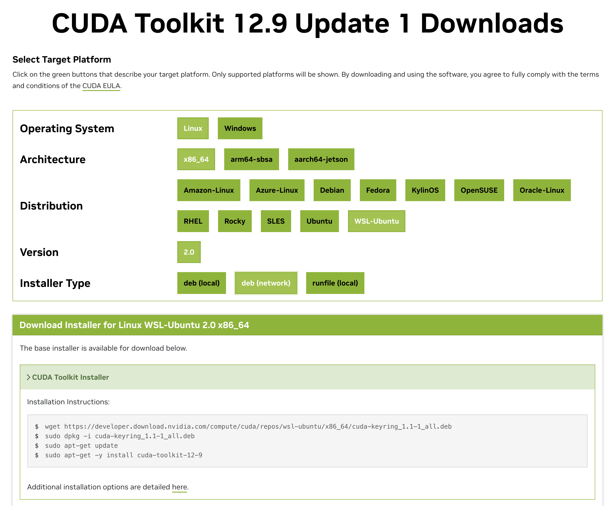
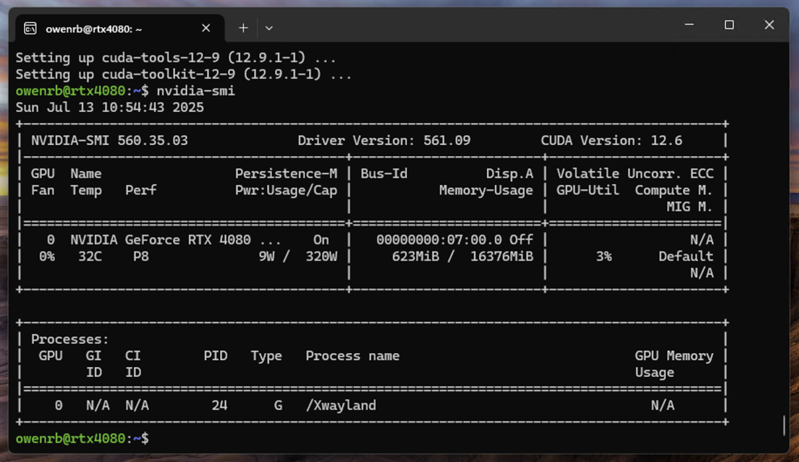

# CUDA Toolkit Installation

**Why CUDA?**: vLLM relies on CUDA for optimized GPU acceleration of large language model (LLM) inference.

## Visit the Official CUDA download site

https://developer.nvidia.com/cuda-downloads

Select: `Linux -> x86_64 -> WSL-Ubuntu -> 2.0 -> deb (network)`

Find the installation instruction section below

## Verify

After installation you can verify via `nvidia-smi`

