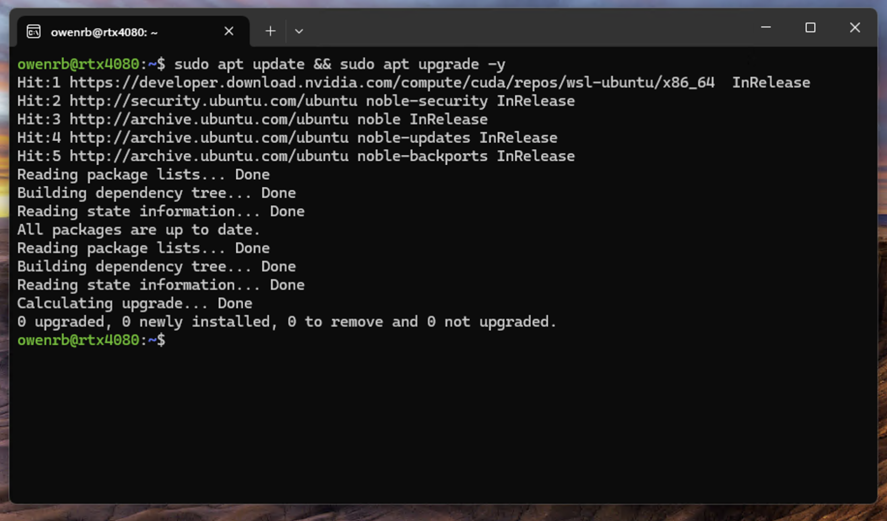
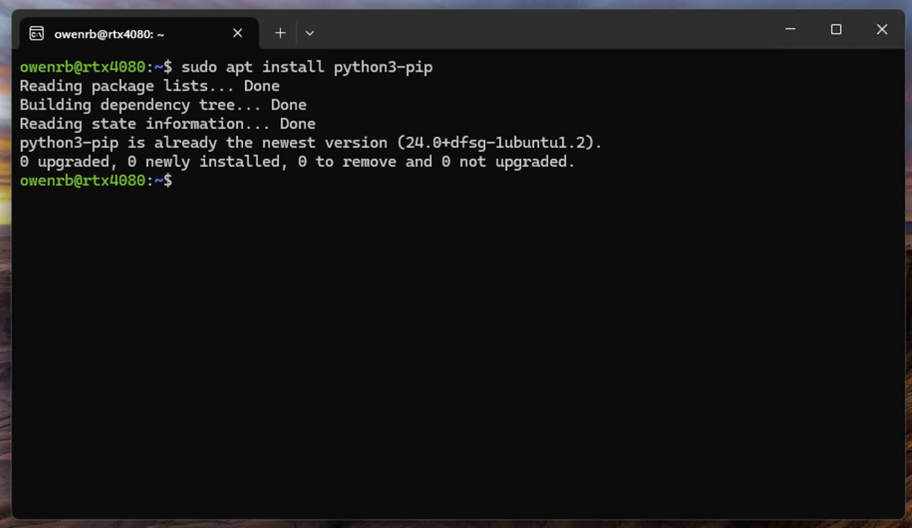
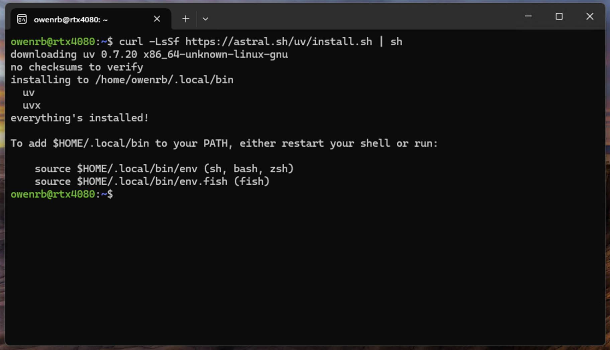

# Python + UV

## Update and Upgrade

```shell
sudo apt update && sudo apt upgrade -y
```



## Install Python PIP

```shell
sudo apt install python3-pip
```



## Install UV

```shell
curl -LsSf https://astral.sh/uv/install.sh | sh
```


