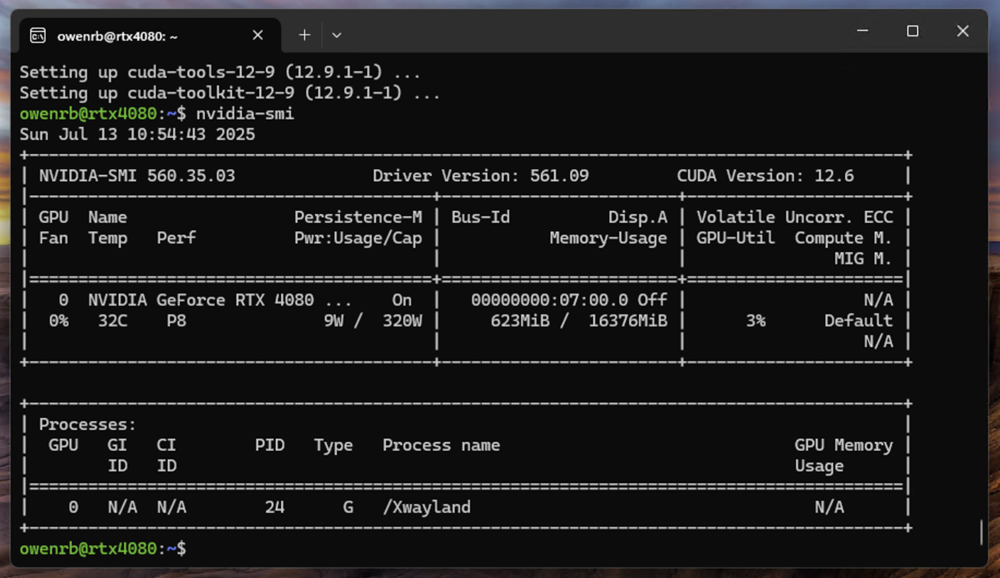

# Install vLLM

## Create Python Environment via UV

```shell
uv venv --python 3.12 --seed
source .venv/bin/activate
```



## Install vLLM

```shell
uv pip install vllm --torch-backend=auto
```

## Run vLLM

```shell
vllm serve Qwen/Qwen2.5-VL-3B-Instruct --gpu_memory_utilization 0.95
```

## Verify

Open browser and go to:

```
http://localhost:8000/docs
```
