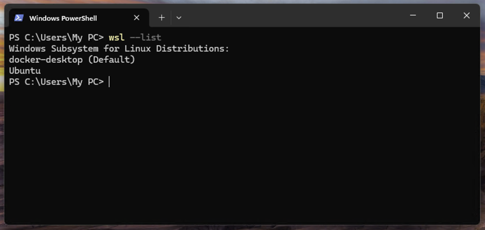
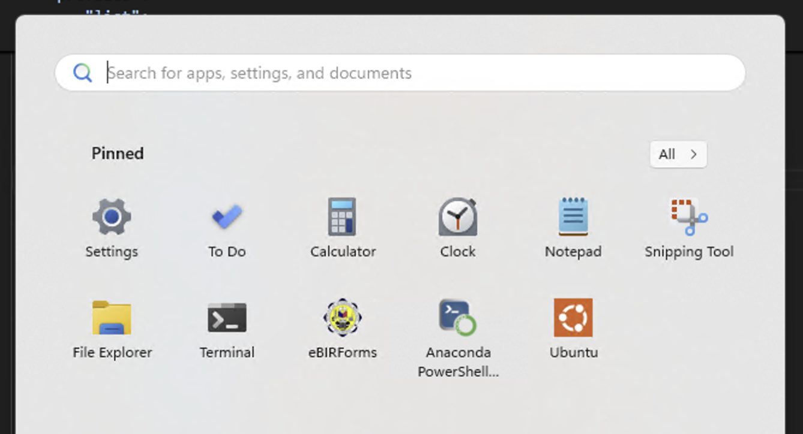
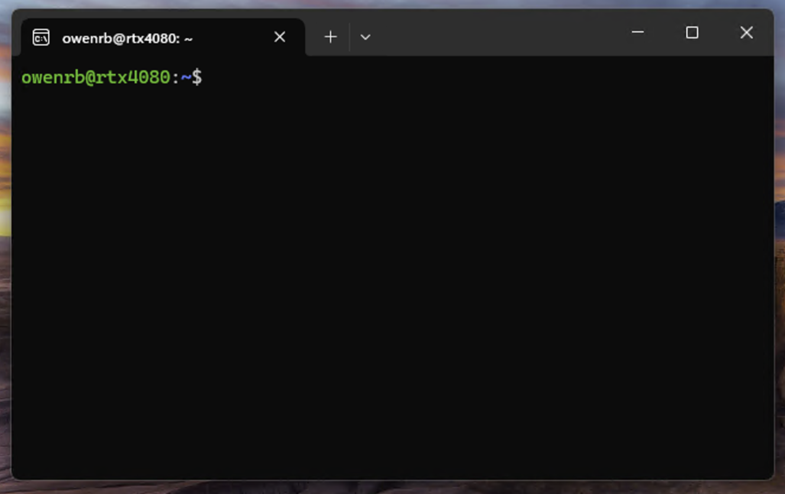

# wsl-vllm

Run your local vLLM on Windows 11

## Check Ubuntu on Windows 11

First, check for `Ubuntu` Linux distribution in your Windows system:

```shell
$> wsl --list
```



Otherwise, install one.

```shell
$> wsl --install
```

## Launch Ubuntu

You should be able to see "Ubuntu" in the Windows Start panel. You may need to "pin" it for easier access on your next login.



Click it to launch Ubuntu console


